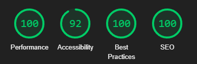
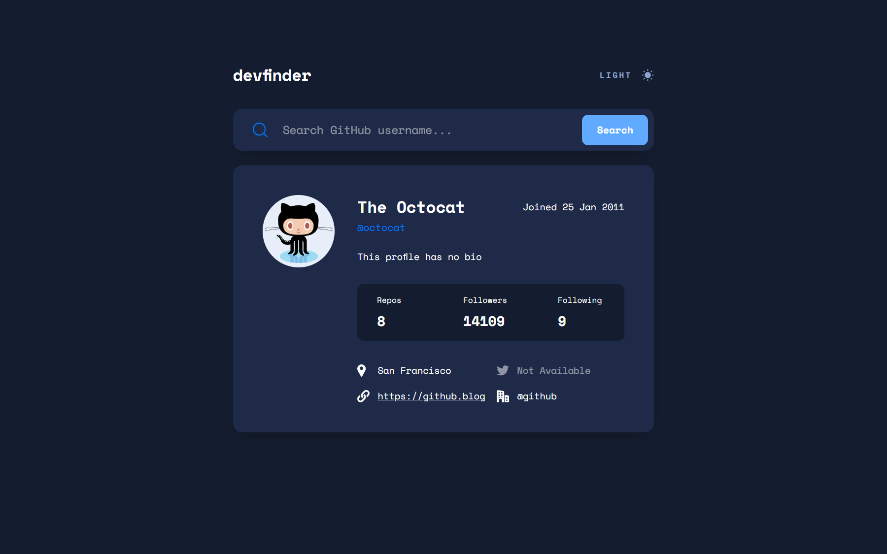
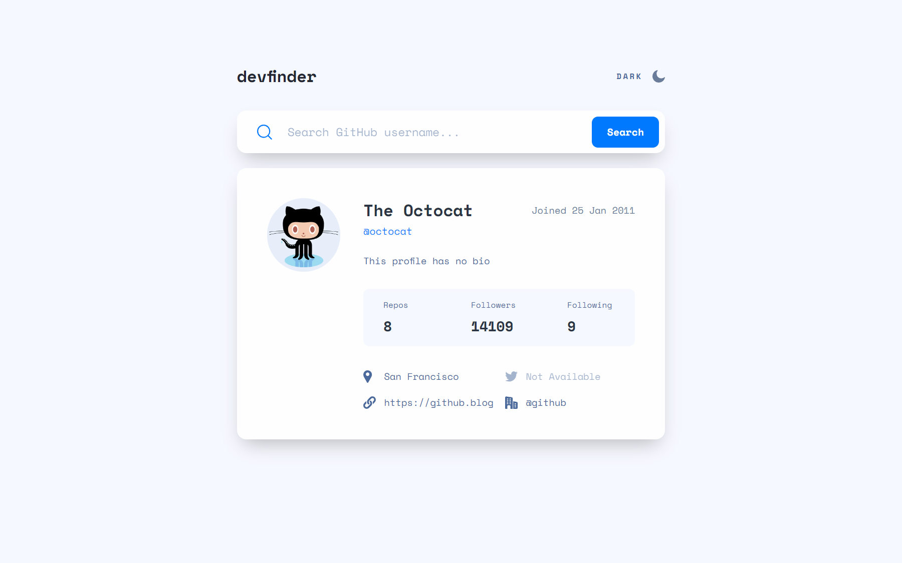
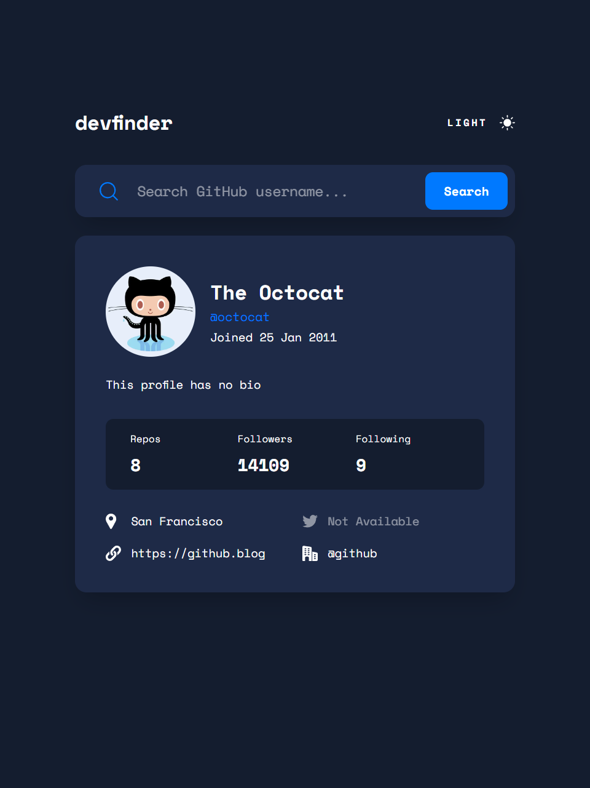
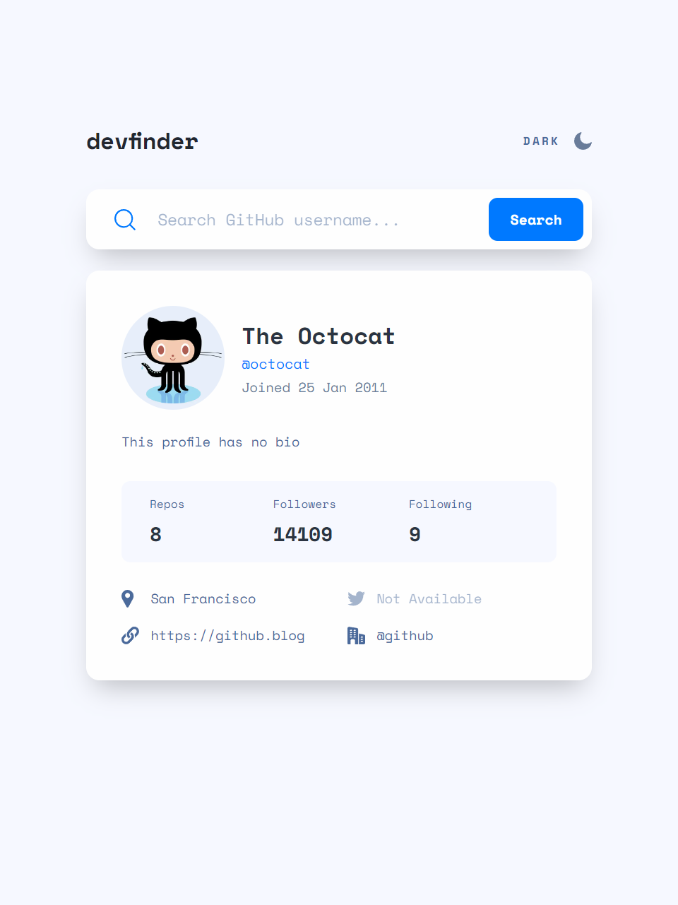
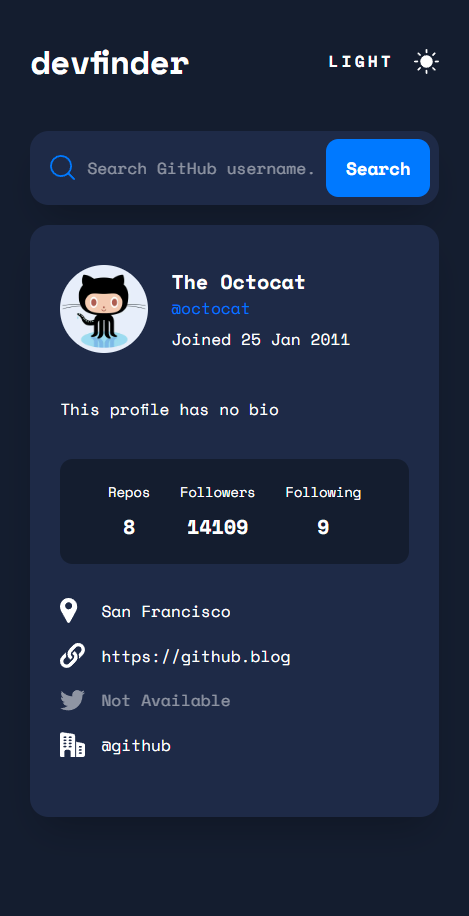
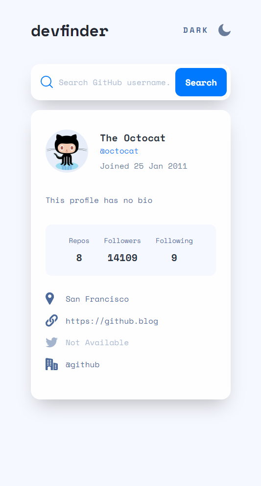

# Frontend Mentor - GitHub user search app solution


This is a solution to the [GitHub user search app challenge on Frontend Mentor](https://www.frontendmentor.io/challenges/github-user-search-app-Q09YOgaH6). Frontend Mentor challenges help you improve your coding skills by building realistic projects.

## Table of contents

- [Frontend Mentor - GitHub user search app solution](#frontend-mentor---github-user-search-app-solution)
  - [Table of contents](#table-of-contents)
  - [Overview](#overview)
    - [The challenge](#the-challenge)
    - [Lighthouse Score](#lighthouse-score)
    - [Screenshot](#screenshot)
    - [Links](#links)
  - [My process](#my-process)
    - [Built with](#built-with)
    - [What I learned](#what-i-learned)
    - [Continued development](#continued-development)
    - [Useful resources](#useful-resources)
  - [Author](#author)
  - [Acknowledgments](#acknowledgments)

## Overview

### The challenge

Users should be able to:

- View the optimal layout for the app depending on their device's screen size
- See hover states for all interactive elements on the page
- Search for GitHub users by their username
- See relevant user information based on their search
- Switch between light and dark themes
- **Bonus**: Have the correct color scheme chosen for them based on their computer preferences. _Hint_: Research `prefers-color-scheme` in CSS.

### Lighthouse Score



### Screenshot









### Links

- Solution URL: [Github](https://github.com/newbpydev/devfinder)
- Live Site URL: [Netlify](https://devfinder-vue.netlify.app/)

## My process

### Built with

- Semantic HTML5 markup
- CSS custom properties
- Flexbox
- CSS Grid
- Mobile-first workflow
- [Vue](https://vuejs.org/) - JS Framework
- [Octokit](https://github.com/octokit/octokit.js) - GitHub API

### What I learned

For this project, I chose to adopt a pure CSS approach, leveraging modern selectors like :has(). This proved particularly useful for managing dark-mode styles. Additionally, I experimented with the prefers-color-scheme media query for the first time, which allowed me to apply custom dark-mode styles based on the user's system preferences.

Moreover, I decided to revisit the Vue framework, as it had been a while since my last project with it. This experience has been remarkably insightful and enriching, offering me a deeper understanding of both CSS and Vue.

```html
<!-- Here I am using the Nullish coalescing operator (??) -->

```

```css
@media (prefers-color-scheme: dark) {
  :root {
    --color-background: var(--color-background-dark);
    --color-text: var(--color-text-white);
    --color-foreground: var(--color-surface-dark);
    --color-logo: var(--color-logo-dark);
    --color-heading: var(--color-heading-dark);
    --color-date: var(--color-text-white);
  }
}
```

```js
// getting the prefers-color-scheme so I could use it in my code
const isDark = ref(false)

onMounted(async () => {
  const mediaQuery = window.matchMedia('(prefers-color-scheme: dark)')
  isDark.value = mediaQuery.matches
})

// I needed to format the date to a specific style,
// sso I used the DateTimeFormat method from the Intl namespace
const joinedDate = computed(() => {
  if (user) {
    const date = new Date(user.created_at)
    const formattedDate = new Intl.DateTimeFormat('en-US', {
      day: 'numeric',
      month: 'short',
      year: 'numeric'
    })
      .format(date)
      .replace(',', '')
      .split(' ')
    const day = formattedDate[1]
    const month = formattedDate[0]
    const year = formattedDate[2]
    return `${day} ${month} ${year}`
  } else {
    return null
  }
})
```

### Continued development

During this project, I utilized several new methods for solving problems, such as nullish coalescing, Vue's composables, and gaining a deeper understanding of the internal workings of the Vue framework. Moving forward, I plan to work on additional projects to further solidify my grasp of these concepts and enhance my proficiency.

### Useful resources

- [Nullish Coalescing Operator](https://developer.mozilla.org/en-US/docs/Web/JavaScript/Reference/Operators/Nullish_coalescing) - The nullish coalescing (??) operator is a logical operator that returns its right-hand side operand when its left-hand side operand is null or undefined, and otherwise returns its left-hand side operand.
- [Vue Composables](https://vuejs.org/guide/reusability/composables.html) - In the context of Vue applications, a "composable" is a function that leverages Vue's Composition API to encapsulate and reuse stateful logic.
- [First Contentful Paint (FCP)](https://web.dev/articles/fcp) - First Contentful Paint (FCP) measures the time from when the user first navigated to the page to when any part of the page's content is rendered on the screen.

## Author

- Website - [Juan Gomez](https://github.com/newbpydev)
- Frontend Mentor - [@newbpydev](https://www.frontendmentor.io/profile/newbpydev)
- Twitter - [@Newb_PyDev](https://twitter.com/Newb_PyDev)

## Acknowledgments

While my code may not yet be on par with my mentor @jonasschmedtman, I am incredibly grateful for his guidance, which has significantly boosted my confidence as a web designer. Additionally, I would like to thank @MaximilianSchwarzmüller from Udemy for his invaluable instruction and support.
